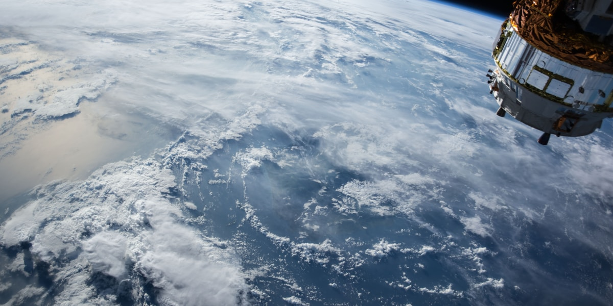

# ORION Mission OS

Plataforma de validacao, simulacao orbital e telemetria para missoes CubeSat.

## Sobre o Projeto

ORION Mission OS e uma solucao desenvolvida para democratizar o acesso a ferramentas de validacao de CubeSats, permitindo que universidades, startups e centros de pesquisa simulem missoes antes do lancamento.

## Equipe

| Nome | RM |
|------|-----|
| Gustavo Noleto | 569592 |
| Lucas Gaspar | 568616 |
| Luiz Ademario | 571182 |

## Estrutura de Pastas

/orion-mission-os
├── index.html
├── css/
│   └── style.css
├── js/
│   └── script.js
├── img/
│   ├── space-01.jpg
│   ├── space-02.jpg
│   └── space-03.jpg
├── integrantes.txt
├── equipe.txt
├── AI.md
└── README.md
## Funcionalidades

### Front-End Design
- Menu funcional com navegacao suave
- 6 secoes: Problema, Tecnologia, Objetivos, Publico-Alvo, Beneficios, Aplicacao
- Rodape com dados da equipe
- Layout responsivo (Desktop, Tablet, Mobile)
- Flexbox e CSS Variables
- Reset CSS e identidade visual consistente

### Web Development
- *Slideshow* — Carrossel automatico com 3 imagens, botoes anterior/proximo e indicadores
- *Formulario de Missao* — Validacao JavaScript (campos obrigatorios, email, valores positivos)
- *Quiz Espacial* — 10 perguntas sobre industria espacial com pontuacao e desempenho
- *Troca de Tema* — 3 temas (Mission Control, Deep Space, Nebula) com persistencia via localStorage
- *Animacoes* — Scroll reveal, hover effects, fade in, smooth scrolling

## Temas Disponiveis

*Mission Control* — Ciano e indigo sobre fundo escuro (padrao)
*Deep Space* — Tons de violeta e azul profundo
*Nebula* — Gradientes roxo e magenta cosmicos

## Tecnologias

HTML5
CSS3
JavaScript (ES6+)
Google Fonts (Orbitron, Inter)

## Paleta de Cores

| Cor | Hex |
|-----|-----|
| Fundo primario | #05070D |
| Fundo secundario | #0B1020 |
| Cards | #111827 |
| Accent ciano | #00D4FF |
| Accent indigo | #4F46E5 |
| Texto | #FFFFFF |

## Disciplina FIAP

Web Development

## Licenca

Projeto academico — FIAP 2026.
